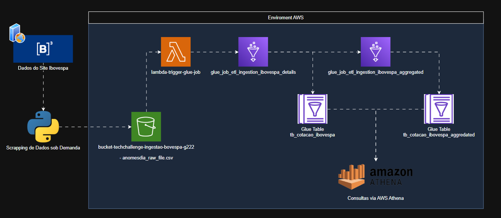

# 🚀 tech-challenge-pipeline-etl-bovespa-g222

Projeto Tech Challenge - Fase 2 - Engenharia de Machine Learning  
Pipeline de Ingestão de Dados ETL via AWS para Dados da Bovespa

---

## 📚 Visão Geral

Este projeto implementa um pipeline de dados automatizado utilizando AWS (S3, Lambda, Glue, Athena) para coletar, processar e disponibilizar dados da Bovespa. O fluxo contempla desde o scraping dos dados até a disponibilização em tabelas particionadas para análise.

---

## 🗂️ Estrutura do Projeto

```
tech-challenge-pipeline-etl-bovespa-g222/
├── docs/                   # Desenhos da arquitura (.drawio e .png)
├── infra/                  # Infraestrutura como código (Terraform)
├── scrapping_on_demand/    # Scraper para coleta dos dados da Bovespa
├── services/
│   ├── glue_aggregated/    # Glue Job para agregação dos dados
│   ├── glue_details/       # Glue Job para ingestão granular dos dados
│   └── lambda/             # Função Lambda para disparo de glue_details
└── .github/workflows/      # CI/CD com GitHub Actions
```

---

## 🔗 Pipeline de Dados

1. **Scraping**  
   O script [`main.py`](scrapping_on_demand/src/main.py) realiza o scraping dos dados da Bovespa e salva o CSV no bucket S3 de ingestão.

2. **Disparo Automático**  
   O upload do arquivo CSV no S3 aciona a função Lambda [`index.py`](services/lambda/index.py), que inicia o Glue Job de ingestão detalhada.

3. **Ingestão Detalhada (Glue Details)**  
   O Glue Job [`main.py`](services/glue_details/app/src/main.py) lê o CSV, normaliza e carrega os dados na tabela particionada do Glue Catalog.

4. **Agregação (Glue Aggregated)**  
   Ao final da ingestão detalhada, um novo Glue Job [`main.py`](services/glue_aggregated/app/src/main.py) é disparado para gerar agregações e salvar em outra tabela.

5. **Consulta e Análise**  
   Os dados processados podem ser consultados via Athena, utilizando as tabelas particionadas.

---

## ⚙️ Arquitetura




## 🔎 Como Executar

### 1. Scraping e Upload

Antes de executar o scraper, é **obrigatório criar um arquivo `.env`** na pasta `scrapping_on_demand/src` contendo as credenciais AWS.  
Essas credenciais são utilizadas para autenticação e upload dos dados para o bucket S3.

Exemplo de `.env`:

```
AWS_ACCESS_KEY_ID=SEU_ACCESS_KEY
AWS_SECRET_ACCESS_KEY=SEU_SECRET_KEY
AWS_DEFAULT_REGION=us-east-1
```

Em seguida, execute o scraper localmente para coletar e enviar os dados:

```sh
cd scrapping_on_demand/src
python main.py
```

### 2. Pipeline Automatizado

O restante do pipeline é automatizado via eventos S3, Lambda e Glue.

---

## 📝 Variáveis Importantes

Veja [infra/terraform/variables.tf](infra/terraform/variables.tf) para nomes de buckets, jobs e configurações.

---

## 🔄 CI/CD

O provisionamento da infraestrutura AWS (buckets S3, Glue Jobs, Lambda, etc.) é realizado automaticamente via **GitHub Actions**, conforme definido no workflow [.github/workflows/terraform.yml](.github/workflows/terraform.yml).

Ao realizar um push ou pull request para a branch `main`, o pipeline executa os seguintes passos:

- Inicializa e aplica o Terraform em [infra/terraform](infra/terraform)
- Faz o empacotamento (`zip`) e upload do código da Lambda para o bucket de artefatos
- Faz o upload dos scripts dos Glue Jobs para o bucket de artefatos

Todo o processo é automatizado, não sendo necessário executar comandos Terraform manualmente. Basta garantir que as secrets AWS estejam configuradas no repositório.

Para mais detalhes, consulte o workflow em [.github/workflows/terraform.yml](.github/workflows/terraform.yml).

---

## 🧰 Tecnologias Utilizadas

- Python 3.11+
- Spark
- Selenium
- BeautifulSoup4
- Pandas
- AWS Glue
- AWS Lambda
- Terraform
- GitHub Actions

---

## 👨‍💻 Desenvolvedores

- Vinnicius Toth - vinni.toth@gmail.com
- G222 Team – FIAP Tech Challenge 2

---